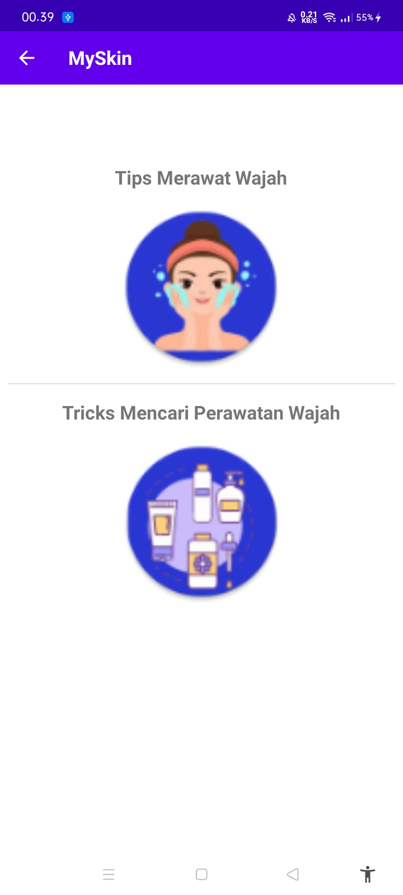
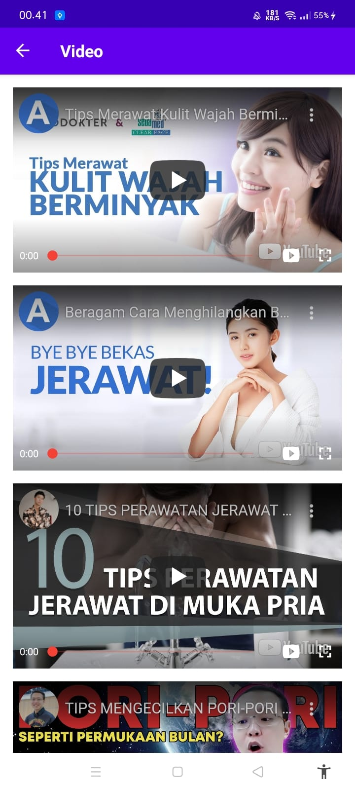

# MySkin

Sebuah karya dari:
- Muhammad Eka Bakhtiar (6706194046) (MuhammadEkaBakhtiar)
- Denna Auliya Putri Ambya (6706190019) (dennaputri)
- Muhammad Aldan Devaney (6706190042) (Aldan55)

Penjelasan singkat mengenai aplikasi.

 Aplikasi MySkin adalah sebuah aplikasi yang dapat memahami kebutuhan kulit
terutama wajah. Aplikasi ini dapat membantu pengguna mengetahui permasalahan
kulit secara spesifik apakah itu jerawat, wajah kering dan kusam, kerutan, kulit
berminyak, eksim, atau yang lainnya. Sistem kami merekomendasikan bahan
kosmetik perawatan kulit yang aman dan efektif untuk Pengguna. Sehingga user
tidak perlu menghabiskan waktu berjam-jam berpindah pindah website untuk
mencari informasi seputar kulit dan kosmetik di internet, kami merangkum semua
itu dalam satu aplikasi yakni MySkin.

Adapun fitur dari aplikasi ini yaitu:

- Permasalahan Kulit: Menampilkan macam-macam permasalahan kulit
wajah disertai dengan foto contoh kasus tersebut serta rekomendasi bahan yang
bagus untuk menyembuhkannya + Pennaggung Jawab: Denna Auliya Putri Ambya 
- Tips & Trick: Fitur ini menayangkan tips merawat kulit wajah & trick untuk mencari skincare + Pennaggung Jawab: Muhammad Eka Bakhtiar
- Diary: Fitur ini berfungsi untuk menyimpan catatan yang menjelaskan kondisi kulit dari user + Pennaggung Jawab: Muhammad Aldan Devaney
- Video: Menampilkan Video Penjelasan tentang skincare atau kandungan-kandungan yang terdapat pada sebuah skincare. + Pennaggung Jawab: Muhammad Eka Bakhtiar

Screenshot aplikasi (minimal 2):
Tampilan Utama                                    | Tampilan Tips&Trik                                | Tampilan Video
--------------------------------------------------|---------------------------------------------------|-----------------------------------------------
||

Link Google Drive (APK + Video Demo):
